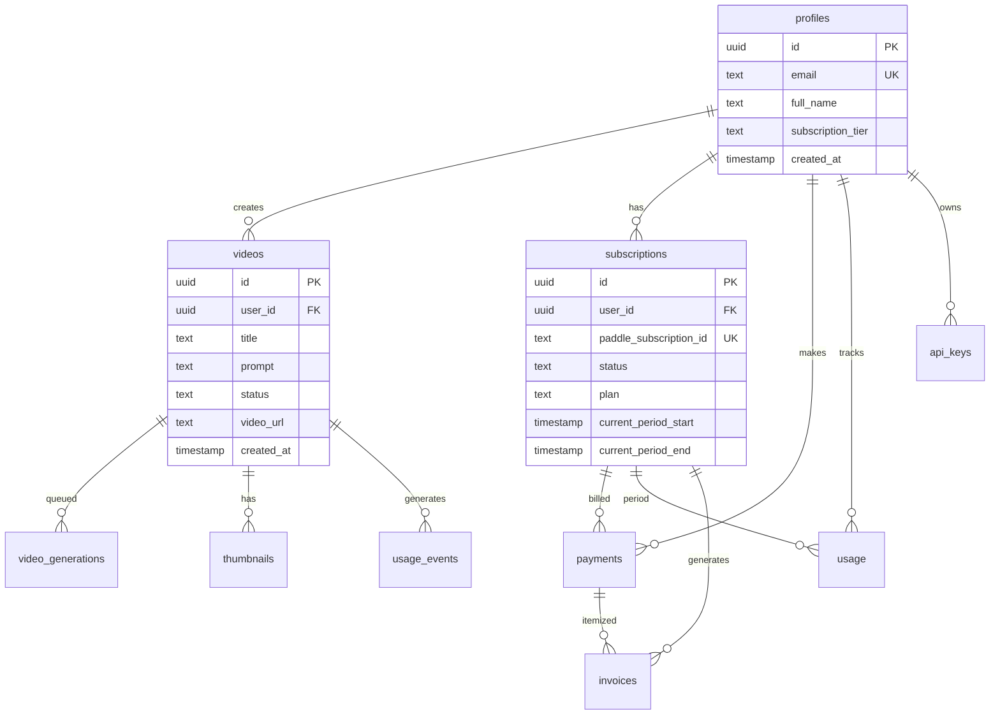

# Database Documentation

Comprehensive database schema and architecture documentation for the Kateriss AI Video Generator platform. This document covers the complete database design, relationships, security policies, and operational procedures.

## Table of Contents

1. [Database Overview](#database-overview)
2. [Schema Design](#schema-design)
3. [Core Tables](#core-tables)
4. [Relationships & Constraints](#relationships--constraints)
5. [Indexes & Performance](#indexes--performance)
6. [Row Level Security (RLS)](#row-level-security-rls)
7. [Database Functions](#database-functions)
8. [Views & Analytics](#views--analytics)
9. [Storage & File Management](#storage--file-management)
10. [Migrations](#migrations)
11. [Backup & Recovery](#backup--recovery)
12. [Performance Monitoring](#performance-monitoring)
13. [Security Best Practices](#security-best-practices)
14. [Data Retention Policies](#data-retention-policies)

## Database Overview

### Technology Stack

- **Database Engine**: PostgreSQL 15+
- **Platform**: Supabase (hosted PostgreSQL)
- **Extensions**: 
  - `uuid-ossp` - UUID generation
  - `pg_cron` - Scheduled tasks
  - `postgis` - Geospatial data (future use)
- **Connection Pooling**: PgBouncer
- **Backup**: Point-in-time recovery (PITR)

### Architecture Principles

- **Data Integrity**: Strong foreign key constraints
- **Security**: Row Level Security (RLS) on all user tables
- **Performance**: Optimized indexes for common queries
- **Scalability**: Partitioned tables for high-volume data
- **Audit Trail**: Comprehensive logging and change tracking
- **GDPR Compliance**: User data anonymization and deletion

### Database Statistics

```sql
-- Current database size and statistics
SELECT 
    schemaname,
    tablename,
    n_live_tup as row_count,
    pg_size_pretty(pg_total_relation_size(schemaname||'.'||tablename)) as size
FROM pg_stat_user_tables 
ORDER BY pg_total_relation_size(schemaname||'.'||tablename) DESC;
```

## Schema Design

### Entity Relationship Diagram



### Naming Conventions

- **Tables**: `snake_case`, plural nouns (`videos`, `user_profiles`)
- **Columns**: `snake_case` (`created_at`, `user_id`)
- **Primary Keys**: `id` (UUID)
- **Foreign Keys**: `{table_name}_id` (`user_id`, `video_id`)
- **Indexes**: `idx_{table}_{columns}` (`idx_videos_user_id_status`)
- **Functions**: `snake_case` with action prefix (`create_video_generation`)
- **Triggers**: `trg_{table}_{action}` (`trg_profiles_updated_at`)

## Core Tables

### 1. Profiles Table

**Purpose**: User account information and preferences

```sql
CREATE TABLE profiles (
    id UUID PRIMARY KEY REFERENCES auth.users(id) ON DELETE CASCADE,
    email TEXT NOT NULL UNIQUE,
    full_name TEXT,
    avatar_url TEXT,
    bio TEXT,
    website TEXT,
    subscription_tier pricing_tier NOT NULL DEFAULT 'pay-per-video',
    subscription_id TEXT UNIQUE,
    api_key_hash TEXT,
    api_key_created_at TIMESTAMPTZ,
    preferences JSONB DEFAULT '{}',
    onboarding_completed BOOLEAN DEFAULT false,
    last_login TIMESTAMPTZ,
    is_active BOOLEAN DEFAULT true,
    created_at TIMESTAMPTZ DEFAULT now(),
    updated_at TIMESTAMPTZ DEFAULT now(),
    
    CONSTRAINT valid_email CHECK (email ~* '^[A-Za-z0-9._%+-]+@[A-Za-z0-9.-]+\.[A-Za-z]{2,}$'),
    CONSTRAINT valid_website CHECK (website IS NULL OR website ~* '^https?://.*')
);

-- Indexes
CREATE INDEX idx_profiles_email ON profiles(email);
CREATE INDEX idx_profiles_subscription_tier ON profiles(subscription_tier);
CREATE INDEX idx_profiles_created_at ON profiles(created_at DESC);

-- Trigger for updated_at
CREATE OR REPLACE FUNCTION update_updated_at_column()
RETURNS TRIGGER AS $$
BEGIN
    NEW.updated_at = now();
    RETURN NEW;
END;
$$ language 'plpgsql';

CREATE TRIGGER trg_profiles_updated_at
    BEFORE UPDATE ON profiles
    FOR EACH ROW
    EXECUTE FUNCTION update_updated_at_column();
```

### 2. Videos Table

**Purpose**: Video generation requests and metadata

```sql
CREATE TABLE videos (
    id UUID PRIMARY KEY DEFAULT gen_random_uuid(),
    user_id UUID NOT NULL REFERENCES profiles(id) ON DELETE CASCADE,
    title TEXT NOT NULL,
    description TEXT,
    prompt TEXT NOT NULL,
    enhanced_prompt TEXT,
    settings JSONB DEFAULT '{}',
    status video_status NOT NULL DEFAULT 'pending',
    stage TEXT DEFAULT 'queued',
    progress INTEGER DEFAULT 0 CHECK (progress >= 0 AND progress <= 100),
    estimated_time_remaining INTEGER, -- seconds
    video_url TEXT,
    thumbnail_url TEXT,
    preview_url TEXT,
    duration NUMERIC(5,2), -- seconds with 2 decimal precision
    resolution TEXT DEFAULT '1080p',
    file_size BIGINT, -- bytes
    format TEXT DEFAULT 'mp4',
    metadata JSONB DEFAULT '{}',
    veo_job_id TEXT UNIQUE,
    cost_credits INTEGER DEFAULT 1,
    generation_time INTEGER, -- seconds
    error JSONB,
    retry_count INTEGER DEFAULT 0,
    max_retries INTEGER DEFAULT 3,
    is_favorite BOOLEAN DEFAULT false,
    is_public BOOLEAN DEFAULT false,
    download_count INTEGER DEFAULT 0,
    view_count INTEGER DEFAULT 0,
    tags TEXT[] DEFAULT '{}',
    category TEXT,
    created_at TIMESTAMPTZ DEFAULT now(),
    updated_at TIMESTAMPTZ DEFAULT now(),
    started_at TIMESTAMPTZ,
    completed_at TIMESTAMPTZ,
    
    CONSTRAINT valid_progress CHECK (progress >= 0 AND progress <= 100),
    CONSTRAINT valid_duration CHECK (duration IS NULL OR duration > 0),
    CONSTRAINT valid_file_size CHECK (file_size IS NULL OR file_size > 0),
    CONSTRAINT valid_retry_count CHECK (retry_count >= 0 AND retry_count <= max_retries),
    CONSTRAINT valid_cost_credits CHECK (cost_credits > 0),
    CONSTRAINT status_completion_check CHECK (
        (status = 'completed' AND completed_at IS NOT NULL AND video_url IS NOT NULL) OR
        (status != 'completed')
    )
);

-- Indexes for performance
CREATE INDEX idx_videos_user_id_status ON videos(user_id, status);
CREATE INDEX idx_videos_user_id_created_at ON videos(user_id, created_at DESC);
CREATE INDEX idx_videos_status_created_at ON videos(status, created_at);
CREATE INDEX idx_videos_veo_job_id ON videos(veo_job_id) WHERE veo_job_id IS NOT NULL;
CREATE INDEX idx_videos_tags ON videos USING gin(tags);
CREATE INDEX idx_videos_category ON videos(category) WHERE category IS NOT NULL;
CREATE INDEX idx_videos_is_favorite ON videos(user_id, is_favorite) WHERE is_favorite = true;

-- Trigger for updated_at
CREATE TRIGGER trg_videos_updated_at
    BEFORE UPDATE ON videos
    FOR EACH ROW
    EXECUTE FUNCTION update_updated_at_column();
```

### 3. Subscriptions Table

**Purpose**: User subscription management

```sql
CREATE TABLE subscriptions (
    id UUID PRIMARY KEY DEFAULT gen_random_uuid(),
    user_id UUID NOT NULL REFERENCES profiles(id) ON DELETE CASCADE,
    paddle_subscription_id TEXT NOT NULL UNIQUE,
    paddle_plan_id TEXT NOT NULL,
    status subscription_status NOT NULL DEFAULT 'active',
    plan pricing_tier NOT NULL,
    current_period_start TIMESTAMPTZ NOT NULL,
    current_period_end TIMESTAMPTZ NOT NULL,
    cancel_at_period_end BOOLEAN DEFAULT false,
    canceled_at TIMESTAMPTZ,
    trial_start TIMESTAMPTZ,
    trial_end TIMESTAMPTZ,
    metadata JSONB DEFAULT '{}',
    created_at TIMESTAMPTZ DEFAULT now(),
    updated_at TIMESTAMPTZ DEFAULT now(),
    
    CONSTRAINT valid_period CHECK (current_period_end > current_period_start),
    CONSTRAINT valid_trial CHECK (
        (trial_start IS NULL AND trial_end IS NULL) OR 
        (trial_start IS NOT NULL AND trial_end IS NOT NULL AND trial_end > trial_start)
    ),
    CONSTRAINT valid_cancellation CHECK (
        (cancel_at_period_end = false AND canceled_at IS NULL) OR
        (cancel_at_period_end = true) OR
        (canceled_at IS NOT NULL)
    )
);

-- Indexes
CREATE INDEX idx_subscriptions_user_id ON subscriptions(user_id);
CREATE INDEX idx_subscriptions_status ON subscriptions(status);
CREATE INDEX idx_subscriptions_paddle_id ON subscriptions(paddle_subscription_id);
CREATE INDEX idx_subscriptions_period_end ON subscriptions(current_period_end);

-- Trigger for updated_at
CREATE TRIGGER trg_subscriptions_updated_at
    BEFORE UPDATE ON subscriptions
    FOR EACH ROW
    EXECUTE FUNCTION update_updated_at_column();
```

### 4. Payments Table

**Purpose**: Payment transaction records

```sql
CREATE TABLE payments (
    id UUID PRIMARY KEY DEFAULT gen_random_uuid(),
    user_id UUID NOT NULL REFERENCES profiles(id) ON DELETE CASCADE,
    subscription_id UUID REFERENCES subscriptions(id) ON DELETE SET NULL,
    paddle_order_id TEXT NOT NULL UNIQUE,
    paddle_checkout_id TEXT,
    amount NUMERIC(10,2) NOT NULL CHECK (amount >= 0),
    currency TEXT NOT NULL DEFAULT 'USD',
    status payment_status NOT NULL DEFAULT 'pending',
    type payment_type NOT NULL DEFAULT 'one-time',
    description TEXT NOT NULL,
    video_count INTEGER CHECK (video_count > 0),
    receipt_url TEXT,
    metadata JSONB DEFAULT '{}',
    created_at TIMESTAMPTZ DEFAULT now(),
    paid_at TIMESTAMPTZ,
    refunded_at TIMESTAMPTZ,
    
    CONSTRAINT valid_amount CHECK (amount >= 0),
    CONSTRAINT valid_payment_completion CHECK (
        (status = 'completed' AND paid_at IS NOT NULL) OR
        (status != 'completed')
    ),
    CONSTRAINT valid_refund CHECK (
        (status IN ('refunded', 'partially_refunded') AND refunded_at IS NOT NULL) OR
        (status NOT IN ('refunded', 'partially_refunded') AND refunded_at IS NULL)
    )
);

-- Indexes
CREATE INDEX idx_payments_user_id_created_at ON payments(user_id, created_at DESC);
CREATE INDEX idx_payments_status ON payments(status);
CREATE INDEX idx_payments_paddle_order_id ON payments(paddle_order_id);
CREATE INDEX idx_payments_subscription_id ON payments(subscription_id) WHERE subscription_id IS NOT NULL;
```

### 5. Usage Table

**Purpose**: Track user usage and limits per billing period

```sql
CREATE TABLE usage (
    id UUID PRIMARY KEY DEFAULT gen_random_uuid(),
    user_id UUID NOT NULL REFERENCES profiles(id) ON DELETE CASCADE,
    subscription_id UUID REFERENCES subscriptions(id) ON DELETE SET NULL,
    plan pricing_tier NOT NULL,
    period_start TIMESTAMPTZ NOT NULL,
    period_end TIMESTAMPTZ NOT NULL,
    videos_generated INTEGER DEFAULT 0 CHECK (videos_generated >= 0),
    videos_limit INTEGER CHECK (videos_limit IS NULL OR videos_limit > 0),
    credits_used INTEGER DEFAULT 0 CHECK (credits_used >= 0),
    credits_total INTEGER DEFAULT 0 CHECK (credits_total >= 0),
    overage_videos INTEGER DEFAULT 0 CHECK (overage_videos >= 0),
    overage_charges NUMERIC(10,2) DEFAULT 0 CHECK (overage_charges >= 0),
    reset_date TIMESTAMPTZ NOT NULL,
    last_reset TIMESTAMPTZ,
    created_at TIMESTAMPTZ DEFAULT now(),
    updated_at TIMESTAMPTZ DEFAULT now(),
    
    CONSTRAINT valid_period CHECK (period_end > period_start),
    CONSTRAINT valid_usage_limits CHECK (
        (videos_limit IS NULL) OR 
        (videos_generated <= videos_limit + overage_videos)
    ),
    CONSTRAINT valid_credits CHECK (credits_used <= credits_total),
    CONSTRAINT unique_user_period UNIQUE (user_id, period_start)
);

-- Indexes
CREATE INDEX idx_usage_user_id_period ON usage(user_id, period_start, period_end);
CREATE INDEX idx_usage_reset_date ON usage(reset_date);
CREATE INDEX idx_usage_plan ON usage(plan);

-- Trigger for updated_at
CREATE TRIGGER trg_usage_updated_at
    BEFORE UPDATE ON usage
    FOR EACH ROW
    EXECUTE FUNCTION update_updated_at_column();
```

## Relationships & Constraints

### Foreign Key Relationships

```sql
-- Core relationships diagram
-- profiles (1) -> (∞) videos
-- profiles (1) -> (∞) subscriptions  
-- profiles (1) -> (∞) payments
-- profiles (1) -> (∞) usage
-- subscriptions (1) -> (∞) payments
-- videos (1) -> (∞) video_generations
-- videos (1) -> (∞) thumbnails

-- Cascade delete rules:
-- User deletion cascades to all user data
-- Video deletion cascades to generations and thumbnails
-- Subscription deletion sets payment subscription_id to NULL
```

### Data Integrity Constraints

**Business Rule Constraints:**
```sql
-- Ensure completed videos have URLs and completion timestamps
ALTER TABLE videos ADD CONSTRAINT check_completed_video 
CHECK (
    (status = 'completed' AND video_url IS NOT NULL AND completed_at IS NOT NULL) OR
    (status != 'completed')
);

-- Ensure subscription periods don't overlap for same user
CREATE UNIQUE INDEX idx_unique_active_subscription 
ON subscriptions(user_id) 
WHERE status = 'active';

-- Ensure usage tracking matches subscription periods
ALTER TABLE usage ADD CONSTRAINT check_usage_subscription_period
CHECK (
    (subscription_id IS NULL) OR
    (period_start >= (SELECT current_period_start FROM subscriptions WHERE id = subscription_id))
);
```

## Indexes & Performance

### Query Optimization Indexes

```sql
-- Video queries (most common)
CREATE INDEX idx_videos_user_status_created ON videos(user_id, status, created_at DESC);
CREATE INDEX idx_videos_processing ON videos(status, created_at) WHERE status IN ('pending', 'processing');

-- User dashboard queries
CREATE INDEX idx_videos_user_recent ON videos(user_id, created_at DESC) WHERE status = 'completed';
CREATE INDEX idx_videos_favorites ON videos(user_id, is_favorite, created_at DESC) WHERE is_favorite = true;

-- Analytics queries
CREATE INDEX idx_videos_date_status ON videos(date_trunc('day', created_at), status);
CREATE INDEX idx_payments_date_status ON payments(date_trunc('day', created_at), status);

-- Search and filtering
CREATE INDEX idx_videos_search ON videos USING gin(to_tsvector('english', title || ' ' || prompt));
CREATE INDEX idx_videos_tags_gin ON videos USING gin(tags);

-- Admin queries
CREATE INDEX idx_profiles_tier_created ON profiles(subscription_tier, created_at DESC);
CREATE INDEX idx_subscriptions_status_end ON subscriptions(status, current_period_end);
```

### Partitioning Strategy

```sql
-- Partition large tables by date for better performance
-- Example: Videos table partitioned by month (for high volume)

CREATE TABLE videos_partitioned (
    LIKE videos INCLUDING ALL
) PARTITION BY RANGE (created_at);

-- Create monthly partitions
CREATE TABLE videos_2025_01 PARTITION OF videos_partitioned
    FOR VALUES FROM ('2025-01-01') TO ('2025-02-01');

CREATE TABLE videos_2025_02 PARTITION OF videos_partitioned
    FOR VALUES FROM ('2025-02-01') TO ('2025-03-01');

-- Automated partition creation function
CREATE OR REPLACE FUNCTION create_monthly_partition(table_name text, start_date date)
RETURNS void AS $$
DECLARE
    partition_name text;
    start_month text;
    end_date date;
BEGIN
    start_month := to_char(start_date, 'YYYY_MM');
    partition_name := table_name || '_' || start_month;
    end_date := start_date + interval '1 month';
    
    EXECUTE format('CREATE TABLE %I PARTITION OF %I FOR VALUES FROM (%L) TO (%L)',
                   partition_name, table_name, start_date, end_date);
END;
$$ LANGUAGE plpgsql;
```

## Row Level Security (RLS)

### Security Policies

```sql
-- Enable RLS on all user tables
ALTER TABLE profiles ENABLE ROW LEVEL SECURITY;
ALTER TABLE videos ENABLE ROW LEVEL SECURITY;
ALTER TABLE subscriptions ENABLE ROW LEVEL SECURITY;
ALTER TABLE payments ENABLE ROW LEVEL SECURITY;
ALTER TABLE usage ENABLE ROW LEVEL SECURITY;

-- Profiles policies
CREATE POLICY "Users can view own profile" ON profiles
    FOR SELECT USING (auth.uid() = id);

CREATE POLICY "Users can update own profile" ON profiles
    FOR UPDATE USING (auth.uid() = id);

CREATE POLICY "Anyone can insert profile" ON profiles
    FOR INSERT WITH CHECK (auth.uid() = id);

-- Videos policies
CREATE POLICY "Users can view own videos" ON videos
    FOR SELECT USING (auth.uid() = user_id);

CREATE POLICY "Users can insert own videos" ON videos
    FOR INSERT WITH CHECK (auth.uid() = user_id);

CREATE POLICY "Users can update own videos" ON videos
    FOR UPDATE USING (auth.uid() = user_id);

CREATE POLICY "Users can delete own videos" ON videos
    FOR DELETE USING (auth.uid() = user_id);

-- Public videos policy (for sharing)
CREATE POLICY "Anyone can view public videos" ON videos
    FOR SELECT USING (is_public = true);

-- Subscriptions policies
CREATE POLICY "Users can view own subscriptions" ON subscriptions
    FOR SELECT USING (auth.uid() = user_id);

-- Admin can view all (service role)
CREATE POLICY "Service role can do everything" ON videos
    FOR ALL USING (auth.jwt() ->> 'role' = 'service_role');
```

### API Key Authentication

```sql
-- API keys table for programmatic access
CREATE TABLE api_keys (
    id UUID PRIMARY KEY DEFAULT gen_random_uuid(),
    user_id UUID NOT NULL REFERENCES profiles(id) ON DELETE CASCADE,
    name TEXT NOT NULL,
    key_hash TEXT NOT NULL UNIQUE,
    key_prefix TEXT NOT NULL,
    permissions TEXT[] DEFAULT '{}',
    last_used_at TIMESTAMPTZ,
    usage_count INTEGER DEFAULT 0,
    rate_limit_rpm INTEGER DEFAULT 60,
    is_active BOOLEAN DEFAULT true,
    expires_at TIMESTAMPTZ,
    created_at TIMESTAMPTZ DEFAULT now(),
    
    CONSTRAINT valid_permissions CHECK (
        permissions <@ ARRAY['video:read', 'video:write', 'video:generate', 'usage:read']
    )
);

-- RLS for API keys
CREATE POLICY "Users can manage own API keys" ON api_keys
    FOR ALL USING (auth.uid() = user_id);

-- Function to authenticate API key
CREATE OR REPLACE FUNCTION authenticate_api_key(api_key text)
RETURNS uuid AS $$
DECLARE
    user_id_result uuid;
BEGIN
    SELECT ak.user_id INTO user_id_result
    FROM api_keys ak
    WHERE ak.key_hash = crypt(api_key, ak.key_hash)
      AND ak.is_active = true
      AND (ak.expires_at IS NULL OR ak.expires_at > now());
    
    IF FOUND THEN
        -- Update usage statistics
        UPDATE api_keys 
        SET last_used_at = now(), usage_count = usage_count + 1
        WHERE key_hash = crypt(api_key, key_hash);
        
        RETURN user_id_result;
    END IF;
    
    RETURN NULL;
END;
$$ LANGUAGE plpgsql SECURITY DEFINER;
```

## Database Functions

### Core Business Functions

```sql
-- Create video generation request
CREATE OR REPLACE FUNCTION create_video_generation(
    p_user_id uuid,
    p_title text,
    p_prompt text,
    p_settings jsonb DEFAULT '{}'
)
RETURNS uuid AS $$
DECLARE
    v_video_id uuid;
    v_can_generate boolean;
BEGIN
    -- Check if user can generate video
    SELECT check_generation_capacity(p_user_id) INTO v_can_generate;
    
    IF NOT v_can_generate THEN
        RAISE EXCEPTION 'Generation capacity exceeded';
    END IF;
    
    -- Create video record
    INSERT INTO videos (user_id, title, prompt, settings)
    VALUES (p_user_id, p_title, p_prompt, p_settings)
    RETURNING id INTO v_video_id;
    
    -- Add to generation queue
    INSERT INTO video_generations (video_id, user_id, priority)
    VALUES (v_video_id, p_user_id, 
            CASE 
                WHEN (SELECT subscription_tier FROM profiles WHERE id = p_user_id) = 'premium' THEN 1
                WHEN (SELECT subscription_tier FROM profiles WHERE id = p_user_id) = 'basic' THEN 2
                ELSE 3
            END);
    
    -- Record usage event
    PERFORM record_usage_event(p_user_id, 'video_generated', 1, v_video_id);
    
    RETURN v_video_id;
END;
$$ LANGUAGE plpgsql SECURITY DEFINER;

-- Check if user can generate video
CREATE OR REPLACE FUNCTION check_generation_capacity(p_user_id uuid)
RETURNS boolean AS $$
DECLARE
    v_tier pricing_tier;
    v_current_usage integer;
    v_limit integer;
BEGIN
    SELECT subscription_tier INTO v_tier FROM profiles WHERE id = p_user_id;
    
    -- Get current month usage
    SELECT COALESCE(videos_generated, 0), COALESCE(videos_limit, 0)
    INTO v_current_usage, v_limit
    FROM usage 
    WHERE user_id = p_user_id 
      AND period_start <= now() 
      AND period_end > now();
    
    CASE v_tier
        WHEN 'premium' THEN
            RETURN true; -- Unlimited
        WHEN 'basic' THEN
            RETURN v_current_usage < v_limit;
        WHEN 'pay-per-video' THEN
            -- Check if they have credits or recent payment
            RETURN EXISTS (
                SELECT 1 FROM payments 
                WHERE user_id = p_user_id 
                  AND type = 'one-time' 
                  AND status = 'completed'
                  AND video_count > 0
                  AND created_at > now() - interval '1 hour'
            );
        ELSE
            RETURN false;
    END CASE;
END;
$$ LANGUAGE plpgsql SECURITY DEFINER;

-- Update video status with validation
CREATE OR REPLACE FUNCTION update_video_status(
    p_video_id uuid,
    p_status video_status,
    p_stage text DEFAULT NULL,
    p_progress integer DEFAULT NULL,
    p_estimated_time integer DEFAULT NULL,
    p_error jsonb DEFAULT NULL
)
RETURNS void AS $$
BEGIN
    UPDATE videos SET
        status = p_status,
        stage = COALESCE(p_stage, stage),
        progress = COALESCE(p_progress, progress),
        estimated_time_remaining = p_estimated_time,
        error = p_error,
        updated_at = now(),
        started_at = CASE 
            WHEN p_status = 'processing' AND started_at IS NULL THEN now()
            ELSE started_at 
        END,
        completed_at = CASE 
            WHEN p_status = 'completed' THEN now()
            WHEN p_status != 'completed' THEN NULL
            ELSE completed_at 
        END
    WHERE id = p_video_id;
    
    -- If completed, remove from generation queue
    IF p_status IN ('completed', 'failed', 'cancelled') THEN
        DELETE FROM video_generations WHERE video_id = p_video_id;
    END IF;
END;
$$ LANGUAGE plpgsql SECURITY DEFINER;
```

### Analytics Functions

```sql
-- Get user analytics
CREATE OR REPLACE FUNCTION get_user_analytics(
    p_user_id uuid,
    p_period_days integer DEFAULT 30
)
RETURNS json AS $$
DECLARE
    result json;
BEGIN
    SELECT json_build_object(
        'total_videos', COUNT(*),
        'completed_videos', COUNT(*) FILTER (WHERE status = 'completed'),
        'failed_videos', COUNT(*) FILTER (WHERE status = 'failed'),
        'total_views', COALESCE(SUM(view_count), 0),
        'total_downloads', COALESCE(SUM(download_count), 0),
        'avg_generation_time', COALESCE(AVG(generation_time), 0),
        'favorite_count', COUNT(*) FILTER (WHERE is_favorite = true)
    ) INTO result
    FROM videos 
    WHERE user_id = p_user_id 
      AND created_at >= now() - (p_period_days || ' days')::interval;
    
    RETURN result;
END;
$$ LANGUAGE plpgsql SECURITY DEFINER;

-- Get system analytics (admin only)
CREATE OR REPLACE FUNCTION get_system_analytics(p_period_days integer DEFAULT 30)
RETURNS json AS $$
DECLARE
    result json;
BEGIN
    -- Check if user has admin privileges
    IF NOT EXISTS (
        SELECT 1 FROM profiles 
        WHERE id = auth.uid() 
          AND (preferences->>'is_admin')::boolean = true
    ) THEN
        RAISE EXCEPTION 'Insufficient privileges';
    END IF;
    
    SELECT json_build_object(
        'total_users', (SELECT COUNT(*) FROM profiles),
        'active_users', (SELECT COUNT(*) FROM profiles WHERE last_login >= now() - interval '7 days'),
        'premium_users', (SELECT COUNT(*) FROM profiles WHERE subscription_tier = 'premium'),
        'total_videos', (SELECT COUNT(*) FROM videos),
        'videos_today', (SELECT COUNT(*) FROM videos WHERE created_at >= CURRENT_DATE),
        'success_rate', (
            SELECT ROUND(
                (COUNT(*) FILTER (WHERE status = 'completed')::float / 
                 NULLIF(COUNT(*) FILTER (WHERE status IN ('completed', 'failed')), 0)) * 100, 2
            )
            FROM videos 
            WHERE created_at >= now() - (p_period_days || ' days')::interval
        )
    ) INTO result;
    
    RETURN result;
END;
$$ LANGUAGE plpgsql SECURITY DEFINER;
```

## Views & Analytics

### User Analytics View

```sql
CREATE VIEW user_analytics AS
SELECT 
    p.id as user_id,
    p.subscription_tier as tier,
    COUNT(v.id) as total_videos,
    COUNT(v.id) FILTER (WHERE v.status = 'completed') as completed_videos,
    COUNT(v.id) FILTER (WHERE v.status = 'failed') as failed_videos,
    COALESCE(SUM(v.file_size), 0) / (1024*1024) as total_storage_mb,
    MAX(v.created_at) as last_video_created,
    DATE_PART('day', now() - p.created_at) as account_age_days,
    p.is_active
FROM profiles p
LEFT JOIN videos v ON p.id = v.user_id
GROUP BY p.id, p.subscription_tier, p.is_active, p.created_at;

-- Grant access to authenticated users for their own data
CREATE POLICY "Users can view own analytics" ON user_analytics
    FOR SELECT USING (auth.uid() = user_id);
```

### System Analytics View

```sql
CREATE VIEW system_analytics AS
SELECT 
    'daily_signups' as metric_name,
    COUNT(*) as metric_value,
    DATE(created_at) as metric_date,
    NULL::pricing_tier as tier
FROM profiles
WHERE created_at >= CURRENT_DATE - INTERVAL '30 days'
GROUP BY DATE(created_at)

UNION ALL

SELECT 
    'daily_videos' as metric_name,
    COUNT(*) as metric_value,
    DATE(created_at) as metric_date,
    NULL::pricing_tier as tier
FROM videos
WHERE created_at >= CURRENT_DATE - INTERVAL '30 days'
GROUP BY DATE(created_at)

UNION ALL

SELECT 
    'tier_distribution' as metric_name,
    COUNT(*) as metric_value,
    CURRENT_DATE as metric_date,
    subscription_tier as tier
FROM profiles
GROUP BY subscription_tier;
```

### Video Generation Queue View

```sql
CREATE VIEW generation_queue AS
SELECT 
    vg.video_id,
    vg.user_id,
    p.subscription_tier as user_tier,
    vg.priority,
    ROW_NUMBER() OVER (ORDER BY vg.priority, vg.created_at) as queue_position,
    -- Estimate wait time based on position and average generation time
    (ROW_NUMBER() OVER (ORDER BY vg.priority, vg.created_at) - 1) * 
    COALESCE((SELECT AVG(generation_time) FROM videos WHERE generation_time IS NOT NULL), 120) / 60 
    as estimated_wait_minutes,
    vg.created_at
FROM video_generations vg
JOIN profiles p ON vg.user_id = p.id
JOIN videos v ON vg.video_id = v.id
WHERE v.status = 'pending'
ORDER BY vg.priority, vg.created_at;
```

## Storage & File Management

### Storage Buckets Configuration

```sql
-- Create storage buckets for file management
INSERT INTO storage.buckets (id, name, public, file_size_limit, allowed_mime_types)
VALUES 
    ('videos', 'videos', true, 524288000, ARRAY['video/mp4', 'video/webm', 'video/quicktime']), -- 500MB limit
    ('thumbnails', 'thumbnails', true, 10485760, ARRAY['image/jpeg', 'image/png', 'image/webp']), -- 10MB limit
    ('avatars', 'avatars', true, 2097152, ARRAY['image/jpeg', 'image/png', 'image/webp']); -- 2MB limit

-- Storage policies
CREATE POLICY "Users can upload own videos" ON storage.objects
    FOR INSERT WITH CHECK (bucket_id = 'videos' AND auth.uid()::text = (storage.foldername(name))[1]);

CREATE POLICY "Anyone can view videos" ON storage.objects
    FOR SELECT USING (bucket_id = 'videos');

CREATE POLICY "Users can upload own thumbnails" ON storage.objects
    FOR INSERT WITH CHECK (bucket_id = 'thumbnails' AND auth.uid()::text = (storage.foldername(name))[1]);

CREATE POLICY "Anyone can view thumbnails" ON storage.objects
    FOR SELECT USING (bucket_id = 'thumbnails');
```

### File Cleanup Function

```sql
-- Clean up expired and orphaned files
CREATE OR REPLACE FUNCTION cleanup_expired_videos(retention_days integer DEFAULT 90)
RETURNS integer AS $$
DECLARE
    deleted_count integer := 0;
    video_record record;
BEGIN
    -- Delete videos older than retention period for non-premium users
    FOR video_record IN 
        SELECT v.id, v.video_url, v.thumbnail_url
        FROM videos v
        JOIN profiles p ON v.user_id = p.id
        WHERE v.created_at < now() - (retention_days || ' days')::interval
          AND p.subscription_tier != 'premium'
          AND v.status = 'completed'
    LOOP
        -- Delete from storage
        IF video_record.video_url IS NOT NULL THEN
            PERFORM storage.delete_object('videos', 
                regexp_replace(video_record.video_url, '^.*/', ''));
        END IF;
        
        IF video_record.thumbnail_url IS NOT NULL THEN
            PERFORM storage.delete_object('thumbnails',
                regexp_replace(video_record.thumbnail_url, '^.*/', ''));
        END IF;
        
        -- Delete video record
        DELETE FROM videos WHERE id = video_record.id;
        deleted_count := deleted_count + 1;
    END LOOP;
    
    RETURN deleted_count;
END;
$$ LANGUAGE plpgsql SECURITY DEFINER;
```

## Migrations

### Migration Management

```sql
-- Migration tracking table
CREATE TABLE IF NOT EXISTS schema_migrations (
    version VARCHAR(255) PRIMARY KEY,
    applied_at TIMESTAMPTZ DEFAULT now(),
    description TEXT
);

-- Example migration: Add video categories
-- Migration: 001_add_video_categories.sql
INSERT INTO schema_migrations (version, description) 
VALUES ('001', 'Add video categories and tags');

ALTER TABLE videos ADD COLUMN IF NOT EXISTS category TEXT;
ALTER TABLE videos ADD COLUMN IF NOT EXISTS tags TEXT[] DEFAULT '{}';

CREATE INDEX IF NOT EXISTS idx_videos_category ON videos(category) WHERE category IS NOT NULL;
CREATE INDEX IF NOT EXISTS idx_videos_tags ON videos USING gin(tags);

-- Example rollback function
CREATE OR REPLACE FUNCTION rollback_migration(migration_version text)
RETURNS void AS $$
BEGIN
    -- Rollback logic specific to each migration
    CASE migration_version
        WHEN '001' THEN
            ALTER TABLE videos DROP COLUMN IF EXISTS category;
            ALTER TABLE videos DROP COLUMN IF EXISTS tags;
            DROP INDEX IF EXISTS idx_videos_category;
            DROP INDEX IF EXISTS idx_videos_tags;
        ELSE
            RAISE EXCEPTION 'Unknown migration version: %', migration_version;
    END CASE;
    
    DELETE FROM schema_migrations WHERE version = migration_version;
END;
$$ LANGUAGE plpgsql;
```

### Schema Versioning

```bash
# Migration script example
#!/bin/bash

# Apply migration
apply_migration() {
    local version=$1
    local file="migrations/${version}.sql"
    
    if [[ -f "$file" ]]; then
        echo "Applying migration $version..."
        psql -f "$file"
        echo "Migration $version applied successfully"
    else
        echo "Migration file not found: $file"
        exit 1
    fi
}

# Rollback migration
rollback_migration() {
    local version=$1
    echo "Rolling back migration $version..."
    psql -c "SELECT rollback_migration('$version');"
    echo "Migration $version rolled back successfully"
}
```

## Backup & Recovery

### Backup Strategy

**Automated Backups (Supabase Pro):**
- Daily full backups with 7-day retention
- Point-in-time recovery (PITR) for last 7 days
- Cross-region backup replication
- Automated backup integrity testing

**Manual Backup Procedures:**
```bash
# Full database backup
pg_dump -h your-db-host -U postgres -d your-database > backup_$(date +%Y%m%d_%H%M%S).sql

# Schema-only backup
pg_dump -h your-db-host -U postgres -d your-database --schema-only > schema_backup.sql

# Data-only backup
pg_dump -h your-db-host -U postgres -d your-database --data-only > data_backup.sql

# Compressed backup
pg_dump -h your-db-host -U postgres -d your-database | gzip > backup_$(date +%Y%m%d).sql.gz
```

### Recovery Procedures

**Point-in-time Recovery:**
```sql
-- Recovery to specific timestamp
SELECT * FROM pg_restore_point('before_incident');

-- Recovery using backup file
psql -h your-db-host -U postgres -d your-database < backup_file.sql
```

**Disaster Recovery Checklist:**
1. [ ] Assess scope of data loss
2. [ ] Identify appropriate recovery point
3. [ ] Notify stakeholders
4. [ ] Execute recovery procedure
5. [ ] Verify data integrity
6. [ ] Resume normal operations
7. [ ] Post-mortem analysis

## Performance Monitoring

### Key Metrics

**Database Performance Metrics:**
```sql
-- Connection pool usage
SELECT 
    state, 
    COUNT(*) 
FROM pg_stat_activity 
GROUP BY state;

-- Slow queries
SELECT 
    query,
    calls,
    total_time,
    mean_time,
    rows
FROM pg_stat_statements 
WHERE mean_time > 1000 
ORDER BY mean_time DESC 
LIMIT 10;

-- Table sizes and bloat
SELECT 
    schemaname,
    tablename,
    n_live_tup as rows,
    pg_size_pretty(pg_total_relation_size(schemaname||'.'||tablename)) as size
FROM pg_stat_user_tables 
ORDER BY pg_total_relation_size(schemaname||'.'||tablename) DESC;

-- Index usage
SELECT 
    schemaname,
    tablename,
    indexname,
    idx_tup_read,
    idx_tup_fetch
FROM pg_stat_user_indexes 
WHERE idx_tup_read = 0;
```

### Monitoring Alerts

**Critical Alerts:**
- Connection pool > 80% utilization
- Query execution time > 5 seconds
- Database size growth > 20% per day
- Failed backup operations
- RLS policy violations

**Warning Alerts:**
- Connection pool > 60% utilization
- Query execution time > 2 seconds
- Table bloat > 30%
- Index hit ratio < 95%
- Long-running transactions > 10 minutes

## Security Best Practices

### Access Control

**Database User Roles:**
```sql
-- Application user (limited permissions)
CREATE ROLE app_user WITH LOGIN PASSWORD 'secure_password';
GRANT USAGE ON SCHEMA public TO app_user;
GRANT SELECT, INSERT, UPDATE, DELETE ON ALL TABLES IN SCHEMA public TO app_user;
GRANT EXECUTE ON ALL FUNCTIONS IN SCHEMA public TO app_user;

-- Read-only analytics user
CREATE ROLE analytics_user WITH LOGIN PASSWORD 'secure_password';
GRANT USAGE ON SCHEMA public TO analytics_user;
GRANT SELECT ON ALL TABLES IN SCHEMA public TO analytics_user;

-- Backup user (minimal permissions)
CREATE ROLE backup_user WITH LOGIN PASSWORD 'secure_password';
GRANT USAGE ON SCHEMA public TO backup_user;
GRANT SELECT ON ALL TABLES IN SCHEMA public TO backup_user;
```

### Data Protection

**Encryption at Rest:**
- Database encryption enabled (AES-256)
- Storage bucket encryption enabled
- Backup encryption enabled
- SSL/TLS for all connections

**Data Anonymization:**
```sql
-- GDPR compliance function
CREATE OR REPLACE FUNCTION anonymize_user_data(p_user_id uuid)
RETURNS void AS $$
BEGIN
    -- Anonymize profile data
    UPDATE profiles SET
        email = 'deleted_' || p_user_id || '@example.com',
        full_name = 'Deleted User',
        bio = NULL,
        website = NULL,
        avatar_url = NULL
    WHERE id = p_user_id;
    
    -- Anonymize video data
    UPDATE videos SET
        title = 'Deleted Video',
        description = NULL,
        prompt = '[Deleted]'
    WHERE user_id = p_user_id;
    
    -- Log anonymization
    INSERT INTO audit_logs (user_id, action, table_name, record_id)
    VALUES (p_user_id, 'ANONYMIZE', 'profiles', p_user_id);
END;
$$ LANGUAGE plpgsql SECURITY DEFINER;
```

## Data Retention Policies

### Retention Rules

**User Data:**
- Active users: Indefinite retention
- Inactive users (2+ years): Data review and potential archival
- Deleted accounts: 30-day grace period, then anonymization

**Video Data:**
- Premium users: Indefinite retention
- Basic users: 1-year retention
- Pay-per-video: 90-day retention
- Failed generations: 7-day retention

**System Data:**
- Audit logs: 2-year retention
- Performance logs: 90-day retention
- Error logs: 1-year retention
- Backup files: 30-day retention

### Automated Cleanup

```sql
-- Scheduled cleanup function (run daily via pg_cron)
CREATE OR REPLACE FUNCTION daily_cleanup()
RETURNS void AS $$
BEGIN
    -- Clean up expired videos
    PERFORM cleanup_expired_videos();
    
    -- Clean up old audit logs
    DELETE FROM audit_logs WHERE created_at < now() - interval '2 years';
    
    -- Clean up processed webhook events
    DELETE FROM webhook_events 
    WHERE processed = true 
      AND created_at < now() - interval '30 days';
    
    -- Clean up old rate limit logs
    DELETE FROM rate_limit_log WHERE created_at < now() - interval '7 days';
    
    -- Vacuum and analyze tables
    PERFORM vacuum_analyze_tables();
END;
$$ LANGUAGE plpgsql;

-- Schedule daily cleanup (requires pg_cron extension)
SELECT cron.schedule('daily-cleanup', '0 2 * * *', 'SELECT daily_cleanup();');
```

---

**This database documentation is a living document. Please keep it updated as the schema evolves.**

*Last Updated: 2025-09-09 | Version: 1.0.0*