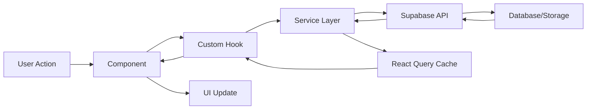

# Development Guide

Comprehensive guide for developing on the Kateriss AI Video Generator platform. This document covers architecture, coding standards, testing strategies, and best practices.

## Table of Contents

1. [Development Setup](#development-setup)
2. [Architecture Overview](#architecture-overview)
3. [Code Structure](#code-structure)
4. [Component Guidelines](#component-guidelines)
5. [State Management](#state-management)
6. [API Integration](#api-integration)
7. [Testing Strategies](#testing-strategies)
8. [Styling & Design System](#styling--design-system)
9. [Performance Optimization](#performance-optimization)
10. [Security Best Practices](#security-best-practices)
11. [Debugging & Tools](#debugging--tools)
12. [Git Workflow](#git-workflow)
13. [Code Review Process](#code-review-process)
14. [Release Process](#release-process)

## Development Setup

### Prerequisites

Ensure you have the following installed:

```bash
# Node.js (version 18.x or higher)
node --version  # v18.17.0+

# npm (comes with Node.js)
npm --version   # 9.x.x+

# Git
git --version   # 2.x.x+

# VS Code (recommended) with extensions:
# - TypeScript Hero
# - ES7+ React/Redux/React-Native snippets
# - Tailwind CSS IntelliSense
# - ESLint
# - Prettier
```

### Local Environment Setup

1. **Clone Repository**
   ```bash
   git clone <repository-url>
   cd kateriss-video-generator-ai
   ```

2. **Install Dependencies**
   ```bash
   npm install
   ```

3. **Environment Configuration**
   ```bash
   cp .env.example .env.local
   # Edit .env.local with your development credentials
   ```

4. **Start Development Server**
   ```bash
   npm run dev
   ```

5. **Verify Setup**
   ```bash
   # Run type checking
   npm run type-check

   # Run linting
   npm run lint

   # Build for production (to verify)
   npm run build
   ```

### Development Tools

**Recommended VS Code Extensions:**
```json
{
  "recommendations": [
    "bradlc.vscode-tailwindcss",
    "esbenp.prettier-vscode",
    "dbaeumer.vscode-eslint",
    "ms-vscode.vscode-typescript-next",
    "formulahendry.auto-rename-tag",
    "christian-kohler.path-intellisense"
  ]
}
```

**VS Code Settings:**
```json
{
  "editor.formatOnSave": true,
  "editor.defaultFormatter": "esbenp.prettier-vscode",
  "editor.codeActionsOnSave": {
    "source.fixAll.eslint": true
  },
  "typescript.preferences.importModuleSpecifier": "relative",
  "emmet.includeLanguages": {
    "typescript": "html",
    "typescriptreact": "html"
  }
}
```

## Architecture Overview

### Tech Stack

**Frontend Architecture:**
```
┌─────────────────────────────────────┐
│              UI Layer               │
├─────────────────────────────────────┤
│ React Components + Tailwind CSS    │
├─────────────────────────────────────┤
│        State Management             │
├─────────────────────────────────────┤
│ Zustand + React Query + Context     │
├─────────────────────────────────────┤
│          Service Layer              │
├─────────────────────────────────────┤
│ Supabase Client + Custom Services   │
├─────────────────────────────────────┤
│          External APIs              │
├─────────────────────────────────────┤
│ Supabase + Paddle + Google Veo      │
└─────────────────────────────────────┘
```

### Data Flow



### File Structure Philosophy

- **Feature-based organization**: Group related components, hooks, and services
- **Separation of concerns**: Clear boundaries between UI, business logic, and data
- **Reusability**: Common components and utilities in shared directories
- **Type safety**: TypeScript types co-located with implementation

## Code Structure

### Directory Layout

```
src/
├── components/          # UI Components
│   ├── ui/             # Basic UI components (Button, Input, etc.)
│   ├── layout/         # Layout components (Header, Footer, etc.)
│   ├── auth/           # Authentication components
│   ├── video/          # Video-related components
│   ├── payment/        # Payment/billing components
│   └── common/         # Shared components
├── hooks/              # Custom React hooks
│   ├── auth/           # Authentication hooks
│   ├── video/          # Video-related hooks
│   ├── payment/        # Payment hooks
│   └── common/         # Shared hooks
├── services/           # API services and utilities
│   ├── api/            # API clients
│   ├── auth/           # Authentication services
│   ├── video/          # Video processing services
│   └── utils/          # Utility functions
├── contexts/           # React contexts
├── types/              # TypeScript type definitions
├── config/             # Configuration files
├── styles/             # Global styles and themes
├── pages/              # Page components (route components)
└── utils/              # General utilities
```

### Naming Conventions

**Files and Directories:**
```bash
# Components: PascalCase
Button.tsx
VideoGenerator.tsx

# Hooks: camelCase with 'use' prefix
useAuth.ts
useVideoGeneration.ts

# Services: camelCase
authService.ts
videoService.ts

# Types: camelCase with descriptive suffix
authTypes.ts
videoTypes.ts

# Utilities: camelCase
formatDate.ts
validateInput.ts
```

**Code Elements:**
```typescript
// Interfaces: PascalCase with 'I' prefix (optional)
interface User {
  id: string;
  email: string;
}

// Types: PascalCase
type VideoStatus = 'pending' | 'processing' | 'completed';

// Constants: UPPER_SNAKE_CASE
const MAX_RETRY_ATTEMPTS = 3;
const API_BASE_URL = 'https://api.example.com';

// Functions: camelCase
const generateVideo = () => {};
const formatDuration = (seconds: number) => {};

// Variables: camelCase
const videoList = [];
const isLoading = false;
```

## Component Guidelines

### Component Structure

**Functional Component Template:**
```typescript
import React from 'react';
import { ComponentProps } from './ComponentName.types';
import { useComponentLogic } from './useComponentName';
import styles from './ComponentName.module.css'; // if needed

/**
 * ComponentName - Brief description of what this component does
 * 
 * @param props - Component props
 * @returns React component
 */
const ComponentName: React.FC<ComponentProps> = ({ 
  prop1, 
  prop2,
  ...props 
}) => {
  const {
    state,
    handlers,
    computed
  } = useComponentLogic({ prop1, prop2 });

  return (
    <div className="component-name" {...props}>
      {/* Component JSX */}
    </div>
  );
};

export default ComponentName;
```

### Props and Types

**Props Interface:**
```typescript
// ComponentName.types.ts
export interface ComponentProps {
  // Required props
  id: string;
  title: string;
  
  // Optional props with defaults
  size?: 'sm' | 'md' | 'lg';
  variant?: 'primary' | 'secondary';
  
  // Event handlers
  onClick?: (event: MouseEvent) => void;
  onSubmit?: (data: FormData) => void;
  
  // Children and className for composition
  children?: React.ReactNode;
  className?: string;
  
  // Extended HTML attributes
} & Omit<React.HTMLAttributes<HTMLDivElement>, 'id' | 'title'>;

// Default props (if using class components)
export const defaultProps: Partial<ComponentProps> = {
  size: 'md',
  variant: 'primary',
};
```

### Custom Hooks Pattern

**Hook Structure:**
```typescript
// useComponentName.ts
import { useState, useEffect, useCallback } from 'react';
import { UseComponentLogicProps, UseComponentLogicReturn } from './types';

export const useComponentName = (props: UseComponentLogicProps): UseComponentLogicReturn => {
  const [state, setState] = useState(initialState);
  
  // Computed values
  const computedValue = useMemo(() => {
    return expensiveComputation(state);
  }, [state]);
  
  // Event handlers
  const handleEvent = useCallback((param: string) => {
    setState(prev => ({ ...prev, value: param }));
  }, []);
  
  // Effects
  useEffect(() => {
    // Side effects
  }, [dependency]);
  
  return {
    // State
    state,
    
    // Computed values
    computedValue,
    
    // Event handlers
    handleEvent,
    
    // Loading states
    isLoading: state.loading,
    
    // Error states
    error: state.error,
  };
};
```

### Error Boundaries

**Error Boundary Component:**
```typescript
// ErrorBoundary.tsx
import React from 'react';

interface Props {
  children: React.ReactNode;
  fallback?: React.ComponentType<{ error: Error; reset: () => void }>;
}

interface State {
  hasError: boolean;
  error: Error | null;
}

class ErrorBoundary extends React.Component<Props, State> {
  constructor(props: Props) {
    super(props);
    this.state = { hasError: false, error: null };
  }

  static getDerivedStateFromError(error: Error): State {
    return { hasError: true, error };
  }

  componentDidCatch(error: Error, errorInfo: React.ErrorInfo) {
    console.error('Error caught by boundary:', error, errorInfo);
    // Log to monitoring service
  }

  reset = () => {
    this.setState({ hasError: false, error: null });
  };

  render() {
    if (this.state.hasError) {
      const FallbackComponent = this.props.fallback || DefaultErrorFallback;
      return <FallbackComponent error={this.state.error!} reset={this.reset} />;
    }

    return this.props.children;
  }
}
```

## State Management

### Zustand Store Pattern

**Store Structure:**
```typescript
// stores/authStore.ts
import { create } from 'zustand';
import { persist } from 'zustand/middleware';
import { AuthState, AuthActions } from './types';

interface AuthStore extends AuthState, AuthActions {}

export const useAuthStore = create<AuthStore>()(
  persist(
    (set, get) => ({
      // State
      user: null,
      isAuthenticated: false,
      isLoading: false,
      error: null,
      
      // Actions
      login: async (credentials) => {
        set({ isLoading: true, error: null });
        try {
          const user = await authService.login(credentials);
          set({ user, isAuthenticated: true, isLoading: false });
        } catch (error) {
          set({ error: error.message, isLoading: false });
        }
      },
      
      logout: () => {
        set({ user: null, isAuthenticated: false, error: null });
      },
      
      clearError: () => set({ error: null }),
    }),
    {
      name: 'auth-storage',
      partialize: (state) => ({ 
        user: state.user, 
        isAuthenticated: state.isAuthenticated 
      }),
    }
  )
);
```

### React Query Integration

**Query Configuration:**
```typescript
// hooks/useVideoQuery.ts
import { useQuery, useMutation, useQueryClient } from '@tanstack/react-query';
import { videoService } from '../services';

export const useVideoList = (filters: VideoFilters) => {
  return useQuery({
    queryKey: ['videos', filters],
    queryFn: () => videoService.getVideos(filters),
    staleTime: 5 * 60 * 1000, // 5 minutes
    refetchOnWindowFocus: false,
  });
};

export const useVideoGeneration = () => {
  const queryClient = useQueryClient();
  
  return useMutation({
    mutationFn: videoService.generateVideo,
    onSuccess: (data) => {
      // Update video list cache
      queryClient.invalidateQueries({ queryKey: ['videos'] });
      
      // Add optimistic update
      queryClient.setQueryData(['video', data.id], data);
    },
    onError: (error) => {
      console.error('Video generation failed:', error);
    },
  });
};
```

### Context Pattern

**Context Setup:**
```typescript
// contexts/VideoContext.tsx
import React, { createContext, useContext, useReducer } from 'react';

interface VideoContextState {
  currentVideo: Video | null;
  generationQueue: Video[];
  settings: VideoSettings;
}

interface VideoContextActions {
  setCurrentVideo: (video: Video | null) => void;
  updateQueue: (queue: Video[]) => void;
  updateSettings: (settings: Partial<VideoSettings>) => void;
}

type VideoContextValue = VideoContextState & VideoContextActions;

const VideoContext = createContext<VideoContextValue | undefined>(undefined);

export const useVideoContext = () => {
  const context = useContext(VideoContext);
  if (!context) {
    throw new Error('useVideoContext must be used within VideoProvider');
  }
  return context;
};

export const VideoProvider: React.FC<{ children: React.ReactNode }> = ({ children }) => {
  const [state, dispatch] = useReducer(videoReducer, initialState);
  
  const actions = {
    setCurrentVideo: (video: Video | null) => 
      dispatch({ type: 'SET_CURRENT_VIDEO', payload: video }),
    updateQueue: (queue: Video[]) => 
      dispatch({ type: 'UPDATE_QUEUE', payload: queue }),
    updateSettings: (settings: Partial<VideoSettings>) =>
      dispatch({ type: 'UPDATE_SETTINGS', payload: settings }),
  };
  
  const value = { ...state, ...actions };
  
  return <VideoContext.Provider value={value}>{children}</VideoContext.Provider>;
};
```

## API Integration

### Service Layer Pattern

**Base Service:**
```typescript
// services/baseService.ts
import { supabase } from '../config/supabase';

export abstract class BaseService {
  protected client = supabase;
  
  protected async handleRequest<T>(
    request: Promise<{ data: T; error: any }>
  ): Promise<T> {
    const { data, error } = await request;
    
    if (error) {
      console.error('API Error:', error);
      throw new Error(error.message || 'An error occurred');
    }
    
    return data;
  }
  
  protected buildQuery(tableName: string) {
    return this.client.from(tableName);
  }
}
```

**Specific Service Implementation:**
```typescript
// services/videoService.ts
import { BaseService } from './baseService';
import { Video, VideoInsert, VideoFilters } from '../types';

class VideoService extends BaseService {
  async getVideos(filters: VideoFilters): Promise<Video[]> {
    let query = this.buildQuery('videos')
      .select('*')
      .order('created_at', { ascending: false });
    
    if (filters.status) {
      query = query.in('status', filters.status);
    }
    
    if (filters.dateFrom) {
      query = query.gte('created_at', filters.dateFrom);
    }
    
    return this.handleRequest(query);
  }
  
  async generateVideo(videoData: VideoInsert): Promise<Video> {
    return this.handleRequest(
      this.buildQuery('videos').insert(videoData).select().single()
    );
  }
  
  async updateVideo(id: string, updates: Partial<Video>): Promise<Video> {
    return this.handleRequest(
      this.buildQuery('videos')
        .update(updates)
        .eq('id', id)
        .select()
        .single()
    );
  }
}

export const videoService = new VideoService();
```

### Error Handling

**Error Types:**
```typescript
// types/errors.ts
export enum ErrorCode {
  NETWORK_ERROR = 'NETWORK_ERROR',
  VALIDATION_ERROR = 'VALIDATION_ERROR',
  AUTHENTICATION_ERROR = 'AUTHENTICATION_ERROR',
  AUTHORIZATION_ERROR = 'AUTHORIZATION_ERROR',
  RATE_LIMIT_ERROR = 'RATE_LIMIT_ERROR',
  SERVER_ERROR = 'SERVER_ERROR',
}

export class AppError extends Error {
  constructor(
    public code: ErrorCode,
    message: string,
    public statusCode?: number,
    public details?: any
  ) {
    super(message);
    this.name = 'AppError';
  }
  
  static fromSupabaseError(error: any): AppError {
    // Map Supabase errors to app errors
    switch (error.code) {
      case 'PGRST116':
        return new AppError(ErrorCode.AUTHENTICATION_ERROR, 'Invalid credentials');
      default:
        return new AppError(ErrorCode.SERVER_ERROR, error.message);
    }
  }
}
```

**Error Handling Hook:**
```typescript
// hooks/useErrorHandler.ts
import { useCallback } from 'react';
import { toast } from 'react-hot-toast';
import { AppError, ErrorCode } from '../types/errors';

export const useErrorHandler = () => {
  const handleError = useCallback((error: unknown) => {
    if (error instanceof AppError) {
      switch (error.code) {
        case ErrorCode.AUTHENTICATION_ERROR:
          toast.error('Please log in to continue');
          // Redirect to login
          break;
        case ErrorCode.VALIDATION_ERROR:
          toast.error(error.message);
          break;
        case ErrorCode.RATE_LIMIT_ERROR:
          toast.error('Too many requests. Please try again later.');
          break;
        default:
          toast.error('Something went wrong. Please try again.');
      }
    } else {
      console.error('Unhandled error:', error);
      toast.error('An unexpected error occurred');
    }
  }, []);
  
  return { handleError };
};
```

## Testing Strategies

### Testing Pyramid

```
┌─────────────────────────┐
│    E2E Tests (Few)      │
├─────────────────────────┤
│ Integration Tests (Some)│
├─────────────────────────┤
│   Unit Tests (Many)     │
└─────────────────────────┘
```

### Unit Testing

**Component Testing:**
```typescript
// Button.test.tsx
import { render, screen, fireEvent } from '@testing-library/react';
import { Button } from './Button';

describe('Button Component', () => {
  it('renders with correct text', () => {
    render(<Button>Click me</Button>);
    expect(screen.getByText('Click me')).toBeInTheDocument();
  });
  
  it('calls onClick when clicked', () => {
    const handleClick = jest.fn();
    render(<Button onClick={handleClick}>Click me</Button>);
    
    fireEvent.click(screen.getByText('Click me'));
    expect(handleClick).toHaveBeenCalledTimes(1);
  });
  
  it('applies correct CSS classes', () => {
    render(<Button variant="primary">Button</Button>);
    expect(screen.getByText('Button')).toHaveClass('btn-primary');
  });
});
```

**Hook Testing:**
```typescript
// useVideoGeneration.test.ts
import { renderHook, act } from '@testing-library/react';
import { QueryClient, QueryClientProvider } from '@tanstack/react-query';
import { useVideoGeneration } from './useVideoGeneration';

const createWrapper = () => {
  const queryClient = new QueryClient({
    defaultOptions: {
      queries: { retry: false },
      mutations: { retry: false },
    },
  });
  
  return ({ children }: { children: React.ReactNode }) => (
    <QueryClientProvider client={queryClient}>
      {children}
    </QueryClientProvider>
  );
};

describe('useVideoGeneration', () => {
  it('should generate video successfully', async () => {
    const { result } = renderHook(() => useVideoGeneration(), {
      wrapper: createWrapper(),
    });
    
    act(() => {
      result.current.mutate({
        title: 'Test Video',
        prompt: 'A test video',
      });
    });
    
    // Test expectations
  });
});
```

### Integration Testing

**Page Testing:**
```typescript
// GeneratePage.test.tsx
import { render, screen, waitFor } from '@testing-library/react';
import userEvent from '@testing-library/user-event';
import { GeneratePage } from './GeneratePage';
import { TestProviders } from '../test-utils';

describe('GeneratePage', () => {
  it('allows user to generate a video', async () => {
    const user = userEvent.setup();
    
    render(
      <TestProviders>
        <GeneratePage />
      </TestProviders>
    );
    
    // Fill form
    await user.type(screen.getByLabelText(/title/i), 'My Video');
    await user.type(screen.getByLabelText(/prompt/i), 'A beautiful scene');
    
    // Submit form
    await user.click(screen.getByRole('button', { name: /generate/i }));
    
    // Verify success
    await waitFor(() => {
      expect(screen.getByText(/video generation started/i)).toBeInTheDocument();
    });
  });
});
```

### Mocking Strategies

**Service Mocking:**
```typescript
// __mocks__/videoService.ts
export const videoService = {
  getVideos: jest.fn(),
  generateVideo: jest.fn(),
  updateVideo: jest.fn(),
};

// In test file
jest.mock('../services/videoService');
const mockVideoService = videoService as jest.Mocked<typeof videoService>;
```

**Supabase Mocking:**
```typescript
// test-utils/supabase-mock.ts
export const createMockSupabaseClient = () => ({
  from: jest.fn(() => ({
    select: jest.fn().mockReturnThis(),
    insert: jest.fn().mockReturnThis(),
    update: jest.fn().mockReturnThis(),
    delete: jest.fn().mockReturnThis(),
    eq: jest.fn().mockReturnThis(),
    in: jest.fn().mockReturnThis(),
    single: jest.fn(),
  })),
  auth: {
    signUp: jest.fn(),
    signInWithPassword: jest.fn(),
    signOut: jest.fn(),
    getUser: jest.fn(),
  },
});
```

## Styling & Design System

### Tailwind Configuration

**Custom Theme:**
```javascript
// tailwind.config.js
export default {
  theme: {
    extend: {
      colors: {
        primary: '#ff0080',
        secondary: '#00ff00',
        accent: '#ff69b4',
      },
      fontFamily: {
        primary: ['Space Grotesk', 'monospace'],
      },
      boxShadow: {
        'brutal': '4px 4px 0px #000',
        'brutal-hover': '8px 8px 0px #000',
      },
    },
  },
};
```

**Component Variants:**
```typescript
// utils/classNames.ts
import { clsx, type ClassValue } from 'clsx';

export function cn(...inputs: ClassValue[]) {
  return clsx(inputs);
}

// Component with variants
const buttonVariants = {
  variant: {
    primary: 'bg-primary text-white border-black',
    secondary: 'bg-secondary text-black border-black',
  },
  size: {
    sm: 'px-3 py-1 text-sm',
    md: 'px-4 py-2 text-base',
    lg: 'px-6 py-3 text-lg',
  },
};

interface ButtonProps {
  variant?: keyof typeof buttonVariants.variant;
  size?: keyof typeof buttonVariants.size;
}

const Button: React.FC<ButtonProps> = ({ 
  variant = 'primary', 
  size = 'md',
  className,
  ...props 
}) => {
  return (
    <button
      className={cn(
        'brutal-shadow border-3 font-bold uppercase tracking-wide',
        buttonVariants.variant[variant],
        buttonVariants.size[size],
        className
      )}
      {...props}
    />
  );
};
```

### Design Tokens

**CSS Custom Properties:**
```css
/* styles/tokens.css */
:root {
  /* Colors */
  --color-primary: #ff0080;
  --color-secondary: #00ff00;
  --color-accent: #ff69b4;
  
  /* Spacing */
  --spacing-xs: 0.25rem;
  --spacing-sm: 0.5rem;
  --spacing-md: 1rem;
  --spacing-lg: 1.5rem;
  --spacing-xl: 2rem;
  
  /* Typography */
  --font-primary: 'Space Grotesk', monospace;
  --font-size-sm: 0.875rem;
  --font-size-md: 1rem;
  --font-size-lg: 1.125rem;
  
  /* Shadows */
  --shadow-brutal: 4px 4px 0px #000;
  --shadow-brutal-hover: 8px 8px 0px #000;
}
```

## Performance Optimization

### Code Splitting

**Route-based Splitting:**
```typescript
// App.tsx
import { lazy, Suspense } from 'react';
import { LoadingSpinner } from './components/ui/LoadingSpinner';

const GeneratePage = lazy(() => import('./pages/GeneratePage'));
const DashboardPage = lazy(() => import('./pages/DashboardPage'));

function App() {
  return (
    <Suspense fallback={<LoadingSpinner />}>
      <Routes>
        <Route path="/generate" element={<GeneratePage />} />
        <Route path="/dashboard" element={<DashboardPage />} />
      </Routes>
    </Suspense>
  );
}
```

**Component-based Splitting:**
```typescript
// Heavy component splitting
const VideoEditor = lazy(() => 
  import('./VideoEditor').then(module => ({ 
    default: module.VideoEditor 
  }))
);
```

### Memoization

**React.memo for Components:**
```typescript
// VideoCard.tsx
import React, { memo } from 'react';

interface VideoCardProps {
  video: Video;
  onPlay: (id: string) => void;
}

export const VideoCard = memo<VideoCardProps>(({ video, onPlay }) => {
  return (
    <div className="video-card">
      {/* Component content */}
    </div>
  );
}, (prevProps, nextProps) => {
  // Custom comparison function if needed
  return prevProps.video.id === nextProps.video.id;
});
```

**useMemo and useCallback:**
```typescript
const VideoList: React.FC<Props> = ({ videos, filters }) => {
  // Expensive computation
  const filteredVideos = useMemo(() => {
    return videos.filter(video => 
      filters.status.includes(video.status)
    );
  }, [videos, filters.status]);
  
  // Event handler
  const handleVideoClick = useCallback((videoId: string) => {
    // Handle click
  }, []);
  
  return (
    <div>
      {filteredVideos.map(video => (
        <VideoCard
          key={video.id}
          video={video}
          onClick={handleVideoClick}
        />
      ))}
    </div>
  );
};
```

### Bundle Analysis

**Analyze Bundle:**
```bash
# Install analyzer
npm install --save-dev @rollup/plugin-analyzer

# Add to vite.config.ts
import { defineConfig } from 'vite';
import { analyzer } from '@rollup/plugin-analyzer';

export default defineConfig({
  plugins: [
    analyzer({ summaryOnly: true })
  ],
});
```

## Security Best Practices

### Input Validation

**Form Validation:**
```typescript
// utils/validation.ts
import { z } from 'zod';

export const videoGenerationSchema = z.object({
  title: z.string()
    .min(1, 'Title is required')
    .max(100, 'Title too long'),
  prompt: z.string()
    .min(10, 'Prompt must be at least 10 characters')
    .max(1000, 'Prompt too long'),
  settings: z.object({
    duration: z.number().min(1).max(30),
    resolution: z.enum(['720p', '1080p', '4k']),
  }),
});

// In component
const form = useForm({
  resolver: zodResolver(videoGenerationSchema),
});
```

### XSS Prevention

**Content Sanitization:**
```typescript
// utils/sanitize.ts
import DOMPurify from 'dompurify';

export const sanitizeHtml = (html: string): string => {
  return DOMPurify.sanitize(html);
};

// Usage in component
const SafeContent: React.FC<{ content: string }> = ({ content }) => {
  return (
    <div 
      dangerouslySetInnerHTML={{ 
        __html: sanitizeHtml(content) 
      }} 
    />
  );
};
```

### Authentication Security

**Token Management:**
```typescript
// utils/tokenManager.ts
class TokenManager {
  private static readonly TOKEN_KEY = 'auth_token';
  private static readonly REFRESH_KEY = 'refresh_token';
  
  static setTokens(accessToken: string, refreshToken: string) {
    localStorage.setItem(this.TOKEN_KEY, accessToken);
    localStorage.setItem(this.REFRESH_KEY, refreshToken);
  }
  
  static getToken(): string | null {
    return localStorage.getItem(this.TOKEN_KEY);
  }
  
  static clearTokens() {
    localStorage.removeItem(this.TOKEN_KEY);
    localStorage.removeItem(this.REFRESH_KEY);
  }
  
  static isTokenExpired(token: string): boolean {
    try {
      const payload = JSON.parse(atob(token.split('.')[1]));
      return Date.now() >= payload.exp * 1000;
    } catch {
      return true;
    }
  }
}
```

## Debugging & Tools

### Development Tools

**React DevTools Setup:**
```typescript
// main.tsx (development only)
if (import.meta.env.DEV) {
  import('@tanstack/react-query-devtools').then(({ ReactQueryDevtools }) => {
    // Initialize devtools
  });
}
```

**Custom Debug Hook:**
```typescript
// hooks/useDebug.ts
import { useEffect, useRef } from 'react';

export const useDebug = (value: any, name: string) => {
  const prevValue = useRef(value);
  
  useEffect(() => {
    if (prevValue.current !== value) {
      console.log(`[DEBUG] ${name}:`, {
        previous: prevValue.current,
        current: value,
      });
      prevValue.current = value;
    }
  }, [value, name]);
};
```

### Logging Strategy

**Logger Service:**
```typescript
// utils/logger.ts
enum LogLevel {
  DEBUG = 0,
  INFO = 1,
  WARN = 2,
  ERROR = 3,
}

class Logger {
  private level: LogLevel = import.meta.env.PROD 
    ? LogLevel.WARN 
    : LogLevel.DEBUG;
  
  debug(message: string, data?: any) {
    if (this.level <= LogLevel.DEBUG) {
      console.debug(`[DEBUG] ${message}`, data);
    }
  }
  
  info(message: string, data?: any) {
    if (this.level <= LogLevel.INFO) {
      console.info(`[INFO] ${message}`, data);
    }
  }
  
  warn(message: string, data?: any) {
    if (this.level <= LogLevel.WARN) {
      console.warn(`[WARN] ${message}`, data);
    }
  }
  
  error(message: string, error?: Error | any) {
    if (this.level <= LogLevel.ERROR) {
      console.error(`[ERROR] ${message}`, error);
      // Send to monitoring service in production
    }
  }
}

export const logger = new Logger();
```

## Git Workflow

### Branch Strategy

```
main
├── develop
│   ├── feature/video-generation
│   ├── feature/payment-integration
│   └── bugfix/auth-issue
├── release/v1.1.0
└── hotfix/critical-bug
```

### Commit Convention

**Commit Message Format:**
```
type(scope): description

[optional body]

[optional footer]
```

**Types:**
- `feat`: New feature
- `fix`: Bug fix
- `docs`: Documentation changes
- `style`: Code style changes
- `refactor`: Code refactoring
- `test`: Test changes
- `chore`: Build/config changes

**Examples:**
```bash
feat(video): add video generation progress tracking
fix(auth): resolve token refresh issue
docs(api): update API documentation
style(ui): improve button component styling
```

### Pre-commit Hooks

**Husky Configuration:**
```bash
# Install husky
npm install --save-dev husky

# Setup pre-commit hook
npx husky add .husky/pre-commit "npm run lint && npm run type-check"
```

## Code Review Process

### Review Checklist

**Functional Review:**
- [ ] Code works as intended
- [ ] Edge cases handled
- [ ] Error handling implemented
- [ ] Performance considerations addressed

**Code Quality:**
- [ ] Follows coding standards
- [ ] Proper TypeScript types
- [ ] No console.log statements
- [ ] Meaningful variable names

**Security:**
- [ ] No hardcoded secrets
- [ ] Input validation implemented
- [ ] XSS prevention measures

**Testing:**
- [ ] Unit tests added/updated
- [ ] Integration tests pass
- [ ] Manual testing completed

### Review Guidelines

**For Authors:**
1. Self-review code before requesting review
2. Write clear PR descriptions
3. Keep PRs focused and small
4. Respond to feedback promptly

**For Reviewers:**
1. Review within 24 hours
2. Provide constructive feedback
3. Test changes locally if needed
4. Approve when satisfied

## Release Process

### Version Management

**Semantic Versioning:**
```
MAJOR.MINOR.PATCH

1.0.0 → 1.0.1 (patch: bug fixes)
1.0.1 → 1.1.0 (minor: new features)
1.1.0 → 2.0.0 (major: breaking changes)
```

### Release Checklist

**Pre-release:**
- [ ] All tests passing
- [ ] Documentation updated
- [ ] Changelog updated
- [ ] Version bumped
- [ ] Security audit completed

**Release:**
- [ ] Create release branch
- [ ] Deploy to staging
- [ ] QA testing
- [ ] Deploy to production
- [ ] Monitor for issues

**Post-release:**
- [ ] Update main branch
- [ ] Create GitHub release
- [ ] Notify stakeholders
- [ ] Monitor metrics

---

**This development guide is a living document. Please keep it updated as the project evolves.**

*Last Updated: 2025-09-09 | Version: 1.0.0*